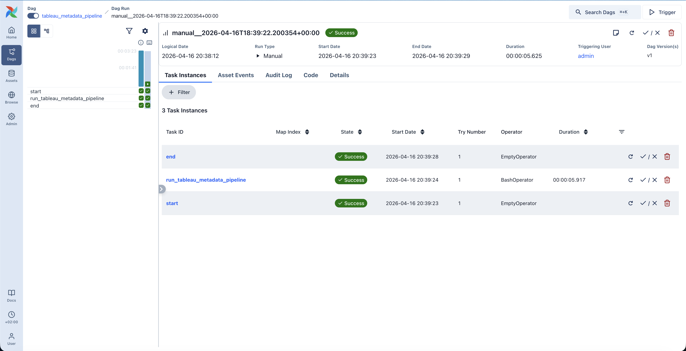

# Tableau Metadata Monitoring Pipeline

## Repository Contents
- `main.py` — Tableau metadata ingestion, transformation, and loading pipeline
- `README.md` — architecture, monitoring, design decision, and answers for Part 2 and Part 3
- `requirements.txt` — Python dependencies
- `bi_assets_metadata.csv` — sample output generated by the pipeline
- `airflow/dags/tableau_metadata_dag.py` — lightweight Airflow DAG used to orchestrate the pipeline

## Overview
This project implements a lightweight BI metadata pipeline using the Tableau REST API, Python, and SQLite.

The goal of the solution is to extract metadata for Tableau assets, transform it into an analytics-ready dataset, and store it in a reusable format for downstream monitoring and reporting. The pipeline focuses on workbook and view metadata and is designed to demonstrate core BI engineering thinking around ingestion, modeling, idempotent loading, and monitoring readiness.

## Architecture
- A Python script authenticates to Tableau Cloud using a Personal Access Token stored in environment variables.
- The pipeline fetches workbook and view metadata from the Tableau REST API, including pagination support.
- Raw API responses are transformed into a consistent analytics-ready schema with standardized field names and derived status logic.
- Transformed records are written into a SQLite table using an upsert pattern to avoid duplicate records across runs.
- The same transformed dataset is also exported to CSV for easy inspection and sharing.
- The pipeline is wrapped in a lightweight Airflow DAG that adds orchestration, scheduling, retry behavior, and execution visibility.

## Storage Design
The solution stores metadata in a single SQLite table called `bi_assets_metadata`.

This table includes asset-level fields such as:
- `asset_id`
- `asset_name`
- `asset_type`
- `workbook_name`
- `project_name`
- `owner_name`
- `owner_id`
- `last_updated`
- `last_viewed`
- `views_last_30d`
- `total_views`
- `refresh_status`
- `status`
- `web_url`
- `last_synced_at`

This schema is intentionally simple so it can be reused directly for reporting and dashboard monitoring. In a warehouse environment, I would extend this into a dimensional model with a core asset dimension and separate fact-style tables for usage and refresh events.

## Transformations and Data Modeling
The pipeline transforms Tableau API responses into a clean, reusable schema with consistent field names across workbooks and views.

A derived `status` field is included to make the dataset immediately useful for BI monitoring. The current logic is:
- `failing_refresh` if refresh status is failed
- `unused` if usage is zero where usage data is available
- `stale` if the asset has not been updated recently
- `active` otherwise

To improve completeness, view-level records are enriched with workbook-level metadata where possible. For example, workbook name, project name, and owner information are backfilled from workbook metadata when those fields are not directly present in the view response.

I also added normalization logic to reconcile workbook display names and content URL slugs, since Tableau can expose different identifiers for the same asset.

## Credentials Management
Credentials are managed through a local `.env` file and loaded into Python with `python-dotenv`.

The following values are required:
- `TABLEAU_SERVER`
- `TABLEAU_SITE_CONTENT_URL`
- `TABLEAU_PAT_NAME`
- `TABLEAU_PAT_SECRET`
- `TABLEAU_API_VERSION`

In a production implementation, credentials would be stored in a secure secret manager such as AWS Secrets Manager, Azure Key Vault, or Databricks Secrets rather than in a local file.

## Scheduling
The pipeline is configured for orchestration in Airflow using a lightweight DAG.

In the current version, the Airflow DAG wraps the existing end-to-end Python script as a single orchestrated task, which makes the job schedulable, retryable, and visible in the Airflow UI. This was the safest first productionization step because it introduced orchestration without changing the core working logic of the pipeline.

If extended further, I would split the DAG into separate tasks for extraction, transformation/loading, and data quality checks.

## Retry and Failure Handling
The current implementation includes:
- request-level error handling for API calls
- logging for authentication, extraction, transformation, and load steps
- database error handling for insert/update operations
- safe sign-out behavior in a `finally` block
- Airflow-level retry behavior for orchestrated runs

In Airflow, the DAG is configured with retry settings so transient failures can be retried automatically. In a fuller production implementation, I would also add alerting on failed DAG runs, late runs, and unexpected row-count changes.

In production, I would add:
- retry logic with exponential backoff for transient API failures
- alerting on repeated pipeline failures
- structured logs shipped to a monitoring platform
- run metadata such as row counts, runtime, and failure reason tracking

## Airflow Orchestration
As a productionization step, I added a lightweight Airflow DAG around the pipeline.

The DAG contains three tasks:
- `start`
- `run_tableau_metadata_pipeline`
- `end`

The main pipeline task uses a `BashOperator` to execute `main.py`. This approach keeps the orchestration layer simple while still adding scheduling, retries, and operational visibility through the Airflow UI.

Given more time, I would decompose the DAG into separate tasks for extraction, transformation/loading, and validation.

### Successful Airflow Run

The screenshot below shows the Airflow DAG successfully executing the metadata pipeline end to end.

## Idempotency / Duplicate Prevention
The pipeline avoids duplicates using an upsert strategy in SQLite.

`asset_id` is used as the primary key, and `INSERT ... ON CONFLICT DO UPDATE` ensures that rerunning the pipeline updates existing records instead of inserting duplicates. This makes the job idempotent and safe to rerun.

## Monitoring and Alerting
If this dataset were used to monitor BI health across the company, I would alert on the following:

- **Stale dashboards:** assets not updated or not viewed within a defined threshold, such as 30, 60, or 90 days
- **Failed data refreshes:** dashboards or datasource-linked assets with failed or unknown refresh states
- **Significant drops in usage:** large week-over-week or month-over-month declines in views
- **Pipeline freshness issues:** if `last_synced_at` is older than the expected schedule, indicating ingestion problems
- **Ownership gaps:** assets missing an owner, which creates accountability risks

For anomaly detection, I would compare usage trends against historical baselines and flag material deviations rather than only using fixed thresholds. 

## Design Decision
One design decision I made was to use SQLite instead of a larger warehouse platform.

I chose SQLite because it allowed me to demonstrate structured storage, a reusable analytics schema, and idempotent upserts without adding unnecessary infrastructure complexity to a take-home exercise. This kept the implementation lightweight while still showing end-to-end BI engineering thinking.

## Notes / Limitations
Some metadata fields requested in the assignment, such as `last_viewed`, `views_last_30d`, and refresh-related fields, were not consistently available from the Tableau REST endpoints used in this lightweight implementation.

Where those fields were unavailable, the pipeline preserves them as null or `'unknown'` rather than inferring values that could be misleading. In a production implementation, I would enrich these fields using Tableau admin views, usage telemetry, audit logs, or refresh/job metadata. 

## Output
The pipeline produces:
- a SQLite database: `bi_metadata.db`
- a CSV export: `bi_assets_metadata.csv`

These outputs can be used directly for inspection, QA, or as the source for a BI monitoring dashboard.

## Part 2 - Data Governance
- Define core business metrics in a centralized metric dictionary or semantic layer, with clear business definitions, formulas, owners, and source tables, so all dashboards reference the same logic.
- Require certified or trusted datasets for dashboard development, and restrict production dashboards from using ad hoc or undocumented data sources.
- Use naming conventions, documentation, and version control for metrics and transformation logic so changes are visible and governed.
- Detect incorrect or outdated data sources by maintaining lineage from dashboard to workbook, datasource, and upstream tables, and regularly auditing dashboards against approved sources.
- Add automated checks that flag dashboards connected to deprecated tables, duplicate extracts, or uncertified sources.
- If two teams define the same metric differently, first compare the business purpose behind each definition and determine whether they are actually measuring different concepts or the same concept inconsistently.
- If the metric should be standardized, align stakeholders on one approved business definition, assign an owner, document it centrally, and update dashboards to use the shared definition.
- If both definitions are valid for different use cases, keep both metrics but rename them clearly, document the difference, and prevent both from being labeled with the same business term.

## Part 3 — Dashboard Design Thinking
If I were building a BI monitoring dashboard using this metadata dataset, I would include the following metrics and charts:

- **Total dashboards / assets by type**  
  A KPI card or bar chart showing counts of workbooks and views. This gives a quick inventory of BI assets across the company.

- **Assets by status**  
  A bar or donut chart showing counts of `active`, `stale`, `unused`, and `failing_refresh` assets. This helps identify overall BI health at a glance.

- **Stale dashboards list**  
  A table of assets not updated or not viewed within a defined threshold, including owner and project. This helps prioritize cleanup and ownership follow-up.

- **Usage trend over time**  
  A line chart showing views over time, such as daily or monthly dashboard usage. This helps detect adoption changes and long-term engagement trends.

- **Low - usage or unused dashboards**  
  A ranked table of dashboards with zero or very low usage. This is useful for deprecation reviews and reducing clutter in the BI environment.

- **Assets by owner or team**  
  A bar chart showing dashboard counts by owner or project/team. This helps identify ownership concentration, coverage gaps, and where governance follow-up may be needed.

- **Pipeline freshness / sync health**  
  A KPI or alert tile using `last_synced_at` to show whether metadata ingestion is running on schedule. This helps ensure the monitoring dashboard itself is trustworthy.

- **Refresh failure monitoring**  
  A table or KPI showing assets with failed or unknown refresh status. This helps detect operational issues that could affect business trust in dashboards.
